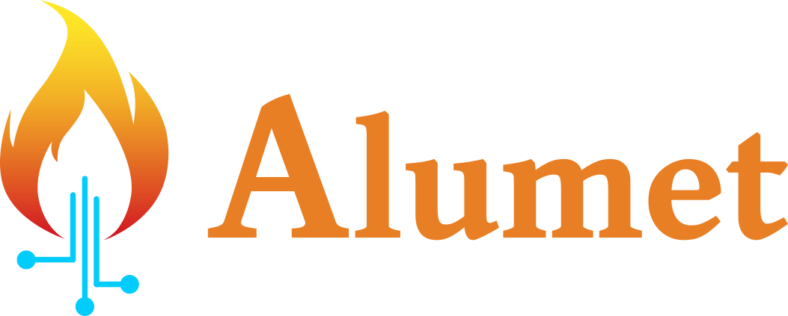

<h1 align="center">
    </img>
</h1>

**Adaptive, Lightweight, Unified Metrics.**

**ALUMET** is a modular tool that measures energy consumption and performance metrics. It offers a new standard framework for all your measurements, with a very low overhead. [Learn more on the website](https://alumet.dev).

<!-- QUICK DEMO ASCIINEMA HERE -->

## Why should I use it?

- [x] I want to estimate the energy consumption of the software I run.
- [x] I want to measure the energy consumption of my CPU or GPU, _accurately_[^1].
- [x] I need to export my measurements to local files or to a database.
- [x] I would like to choose the acquisition frequency and to be able to use frequencies above 1000 Hz.
- [x] I _don't_ want the measurement tool to eat up my CPU and consume too much power.
- [x] I _don't_ want to setup a different tool for each hardware component and software environment I have (laptops, Edge devices with GPUs, bare-metal HPC servers, K8S clusters, ...).

If you answer yes to any of these questions, Alumet is for you!

We also have extra features (see the documentation).

[^1]: See the following research paper for a detailed analysis of some common errors in RAPL-based measurement tools: [Guillaume Raffin, Denis Trystram. Dissecting the software-based measurement of CPU energy consumption: a comparative analysis. 2024. ⟨hal-04420527v2⟩](https://hal.science/hal-04420527).

## How to use

Please read [the Alumet user book](https://alumet-dev.github.io/user-book/) to learn how to install and use the Alumet "agent" (the program that performs the measurements).

If you have a question, feel free to ask on the [Discussions page](https://github.com/alumet-dev/alumet/discussions).

## Extending Alumet

The `alumet` crate provides a library with a plugin system. With plugins, you can extend Alumet in the following ways:
- read new sources of measurements
- apply arbitrary transformations to the data (such as energy attribution models)
- export the data to new outputs
- perform actions on startup and shutdown

Please read [the Alumet developer book](https://alumet-dev.github.io/developer-book/) to learn how to make plugins.

## Contributing

Alumet is a joint project between the LIG (computer science laboratory of Grenoble) and Eviden (Atos HPC R&D). It is also open to external volunteers like you!

Please go to the [contributing guide](./CONTRIBUTING.md) to get started.

## License

Copyright 2024 Guillaume Raffin, BULL SAS, CNRS, INRIA, Grenoble INP-UGA.
Licensed under the EUPL-1.2 or later.

You can find [more information about the EUPL here](https://joinup.ec.europa.eu/collection/eupl/introduction-eupl-licence). The EUPL is compatible with many other open source licenses and shares some principles with the well-known LGPL.
