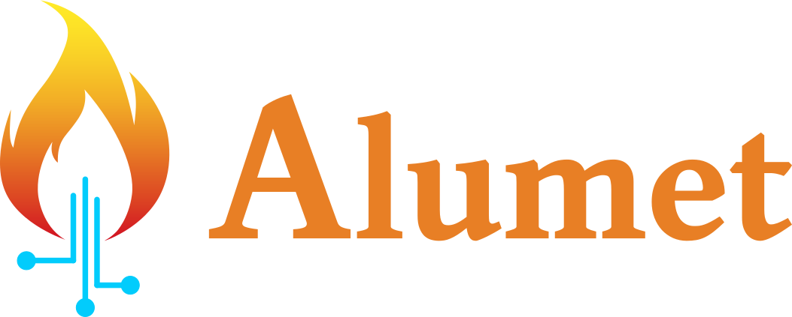

<h1 align="center">
    </img>
</h1>

Adaptive, Lightweight, Unified Metrics.

**Alumet** is a high-performance, high-frequency and high-precision monitoring tool for local and distributed systems.

## Overview

Alumet collects useful metrics about a running system, such as:
- system metrics (CPU usage, memory usage, network bandwidth, etc.)
- hardware-specific metrics (e.g. utilization rate of NVIDIA and AMD GPUs)
- application performance metrics (e.g. CPU usage of a process or container)
- energy metrics (e.g. real-time energy consumption of your CPU or GPU)
- attributed resource consumption (e.g. the energy "consumed" by a process)

Alumet is a configurable framework that adapts to your use case. It can be deployed in a wide range of environments: simple laptops, bare-metal Linux servers, distributed HPC systems made of hundreds of nodes, Kubernetes clusters, etc.

Alumet aims to enable energy observability in various scenarios, from research experiments to industrial production.

## Key Features

- **Genericity**: Alumet's core does not depend on a specific hardware nor on a single software stack. You can leverage a common tool and data model for every setup.
- **Efficiency**: Alumet is lightweight and fast, and can sustain higher measurement frequencies than its competitors (up to 10 000 Hz!).
- **Precision and Robustness**: Backed by research work and industrial best practices, Alumet avoids the common biases that ruin your data.
- **Extensibility**: Implementing new hardware/software metrics is easy. Alumet will support more and more environments over time.
- **Human Control**: You decide what Alumet gathers for you, you control how it transforms data. For advanced use cases, you can even extend Alumet to make your own measurement tool.

## Getting Started

### User Documentation

Learn how to install, configure, and use the Alumet monitoring agent in the [Alumet User Book](https://alumet-dev.github.io/user-book/).

### Developer Documentation

If you want to extend Alumet or build custom monitoring solutions, check out the [Alumet Developer Book](https://alumet-dev.github.io/developer-book/) to learn about the plugin system and framework.

### Need Help?

Talk to us on the [Discussions page](https://github.com/alumet-dev/alumet/discussions).

## Contributing

Alumet started as a joint project between the LIG (computer science laboratory of Grenoble) and Bull (french supercomputer company), but its community is growing beyond that.
The project is open to external volunteers like you!

Please refer to the [contributing guide](./CONTRIBUTING.md) to get started.
Note that you don't necessarily need to _code_ to contribute, there are other forms of contribution.

## License

Alumet is a free and open-source software licensed under the EUPL-1.2 or later.

Initial owners (PhD work of Guillaume Raffin): Copyright 2024 BULL SAS, CNRS, INRIA, Institut Polytechnique de Grenoble, Université Grenoble Alpes, INPG Entreprise SA.
Later contributions are owned by their respective authors (if it's part of the contributor's job, the employer holds the economic rights, per european copyright law).

The EUPL is compatible with many other open source licenses and shares some principles with the well-known AGPL and LGPL.
You can find [more information about the EUPL here](https://joinup.ec.europa.eu/collection/eupl/introduction-eupl-licence).

