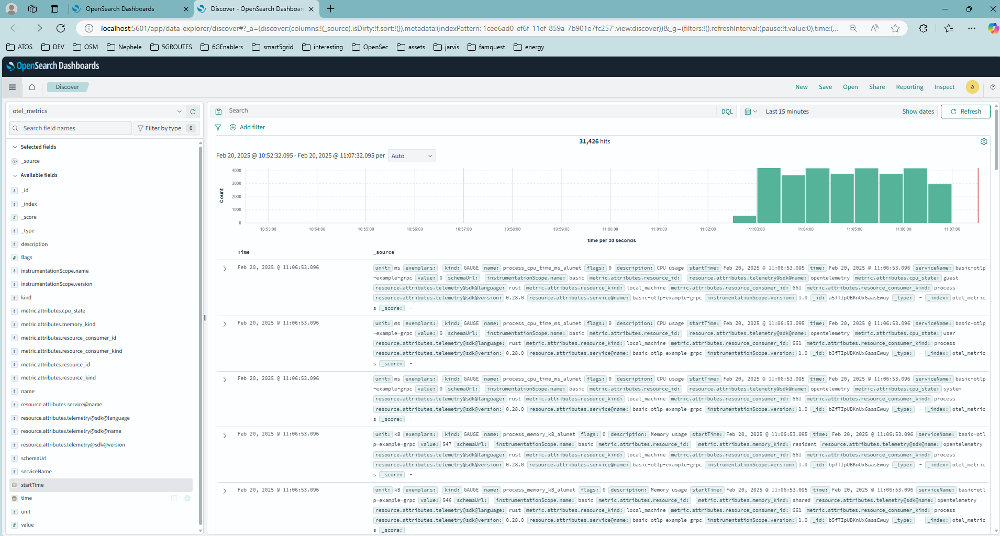

# OpenTelemetry plugin

This crate is a library that defines the OpenTelemetry plugin.

Implements a push-based exporter (via gRPC) which can be connected to an OpenTelemetry Collector (via a receiver), processed in any way, and then exported to a observability backend like Jaeger, Prometheus, Thanos, OpenSearch, ElasticSearch, etc.

## Demos

The plugin has been tested on a NUC with the default configuration.

### OpenTelemetry demo

The connection to the OpenTelemetry Collector was done following the [official Data Prepper tutorial](https://github.com/opensearch-project/data-prepper/tree/main/examples/metrics-ingestion-otel).

Notes:
- For clarity, I disconnected traces and metrics from other sources to better visualize in OpenSearch.
- Also, the "logging" exporter is deprecated and needs to be updated.

```yaml # data-prepper/examples/metrics-ingestion-otel/otel-collector-config.yml
receivers:
  # hostmetrics:
  #   collection_interval: 60s
  #   scrapers:
  #     cpu:
  #     memory:
  # prometheus:
  #   config:
  #     scrape_configs:
  #       - job_name: data-prepper
  #         metrics_path: /metrics/sys
  #         scrape_interval: 60s
  #         static_configs:
  #           - targets: ['data-prepper:4900']
  otlp:
    protocols:
      grpc:
        endpoint: 0.0.0.0:4317

exporters:
  debug: # Appears as "logging" 
    verbosity: detailed
```



## Next
