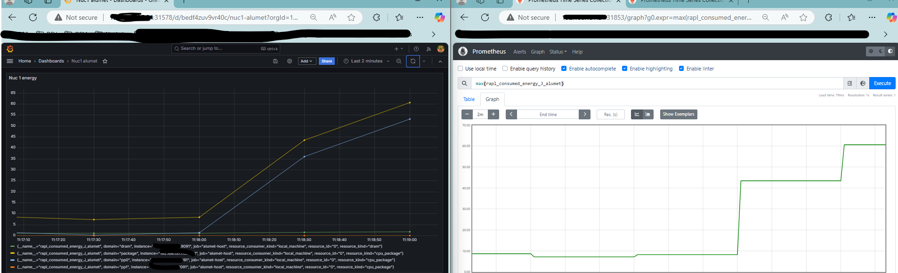
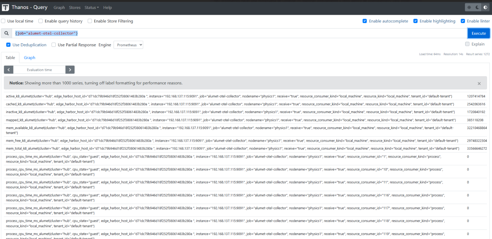

# Prometheus Exporter plugin

This crate is a library that defines the Prometheus Exporter plugin.

Implements a pull-based exporter which can be consumed by all monitoring tools compatible with the OpenMetrics specification.

## Demos

The plugin has been tested on a NUC with the default configuration.

### Prometheus demo

The connection to the prometheus server was done via the [kube-prometheus-stack](https://github.com/prometheus-community/helm-charts/blob/main/charts/kube-prometheus-stack/README.md) and the [ScrapeConfig here](./docs/alumet-scrape-config.yaml) (replace the targets IP and ensure that the port 9091 is accessible).

For the demo, the "stress --cpu 8 --io 4 --vm 2 --vm-bytes 128M" command was used to ensure that data was pulled correctly.



## Opentelemetry

The same exporter has been connected to an Opentelemetry Stack (without an actual prometheus server) and redirected to a Thanos using the following receiver config:

```yaml
receivers:
  prometheus:
    config:
      scrape_configs:
        - job_name: 'alumet-otel-collector'
          scrape_interval: 10s
          static_configs:
            - targets: \['X.X.X.X:9091']
```



## Next

Future:
- Filter which outputs to expose.
- Account for fluctuations not picked up by the prometheus server pull frequency.
- Customize how each metric is represented in the exporter (everything is a Gauge for floats right now).
- Ensure it can be used in k8s with a nginx (or similar) to expose it in the cluster.
