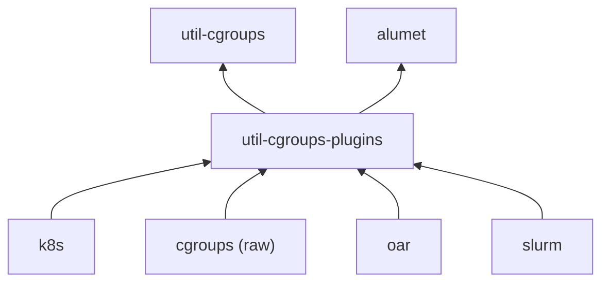

# Cgroups Plugins and Utilities

This directory contains the source code of Alumet plugins that rely on the Linux control groups (abbreviated "cgroups").

Common parts can be found in two separate libraries:
- `util-cgroups`: Helpers to detect and measure cgroups. This crate is independent of Alumet.
- `util-cgroups-plugins`: Alumet sources for cgroups and their configuration.

Cgroup-based plugins:
- `cgroups` (in folder `raw`): measures basic cgroups
- `k8s`: measures Kubernetes pods
- `oar`: measures OAR HPC jobs
- `slurm`: measures Slurm HPC jobs

## Dependency Graph

The dependencies of the different crates are illustrated by the following diagram.

