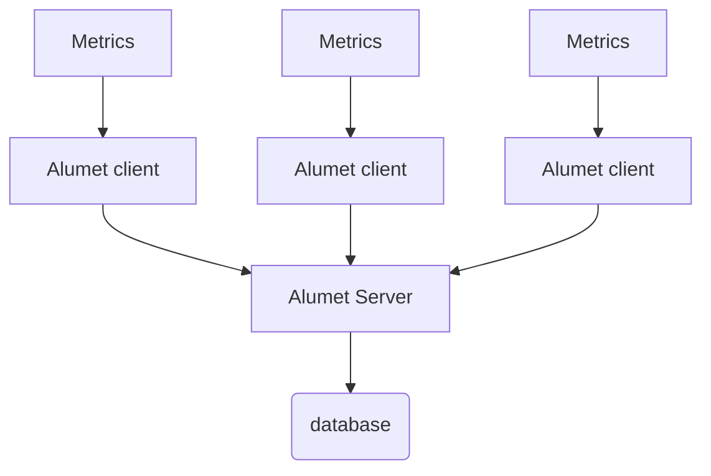

# Relay plugin

The relay plugin allows to send and receive measurements over the network, with an efficient protocol based on [postcard](https://github.com/jamesmunns/postcard) binary serialization.

The relay plugin is in fact made of two parts (relay-client plugin and relay-server plugin):

- `client`: sends all measurements to the relay server. Usually the client is configured with input and transform plugins for reading metrics and calculation.
- `server`: receives measurements from one or multiple clients. Usually the server is configured with output plugin to write measurements in a database.

The server and client plugin must be enabled and configured independently. A standard configuration is several clients communicate with one server as described in the schema below:



## Requirements

At least, 2 alumet agents must be running (at minimum, 1 client and 1 server) allowing communication between alumet client and alumet server.

## Configuration

### Client

Here is a configuration example of the plugin for the client. It's part of the Alumet configuration file (eg: `alumet-config.toml`).

```toml
[plugins.relay-client]
    enable = true
    client_name = "${NODE_NAME}"
    relay_server = "192.168.1.10:50051"
    buffer_max_length = 200
    buffer_timeout = "30s"

[plugins.relay-client.retry]
    max_times = 5
    initial_delay = "1s"
    max_delay = "10s"
```

### Server

Here is a configuration example of the plugin for the server. It's part of the Alumet configuration file (eg: `alumet-config.toml`).

```toml
[plugins.relay-server]
    enable = true
    address = "[::]:50051"
```

## More information

### client

[plugins.relay-client]:
- `client_name`: usually it is set using an environnement variable
- `relay_server`: \<ip address or k8s service name of the server>:\<port number>
- `buffer_max_length`: the buffer is filled with measurements over time and when it is full (buffer max length reach), the buffer is empty by sending all measurements to the server. The size is in bytes. Default is 4096.
- `buffer_timeout`: this is the maximum delay to empty the buffer even if it is not full. Default value is 30s.

[plugins.relay-client.retry]:
- `max_times`: maximum number of times that the client retries to connect to the server when a failure occurred. Default value is 8.
- `initial_delay`: delay to wait after the 1st and second retry connection to the server. Default value is 500ms.
- `max_delay`: delay to wait between each retry after the second retry failure. Default value is 4s.

The format related to parameters which are a duration (`buffer_timeout`, `initial_delay`, `max_delay`) is a concatenation of time spans. Where each time span is an integer number and a [suffix](https://docs.rs/humantime/latest/humantime/fn.parse_duration.html).

A useful feature of Alumet is that you can override the address/port with the command-line option `--relay-out`.

```sh
alumet-agent --relay-out 172.16.48.9:50051
```

### server

- `address` = "[::]:\<port number>" ; [::] means that all network interfaces IPV6 are listening. You can configure a specific IPV6/IPV4 network interface if needed:
  - "172.16.48.8:50051" to listen on a specific IPV4 address
  - "[fe80::a225:9fff:fe08:f874%8]:50051" to listen on a specific IPV6 address, according IPV6 configuration (host-local or global), it can be mandatory or not to specify the network interface. If yes, then the format is: \<IPV6 address>%\<network interface>
  In the above example, the network interface is _8_ an the IPV6 address is _fe80::a225:9fff:fe08:f874_

A useful feature of Alumet is that you can override the address/port with command-line option `--relay-in`.

```sh
alumet-agent --relay-in 172.16.48.9:50051
```
