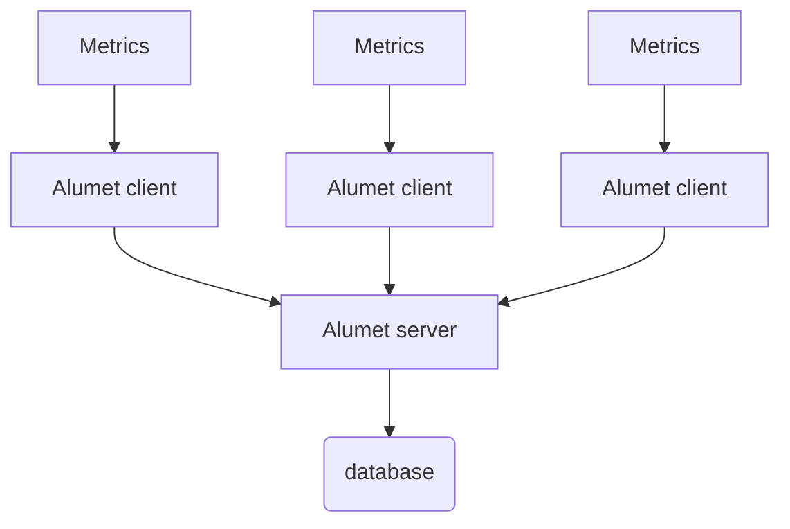

# Relay plugins

The relay plugins allow to send and receive measurements over the network, with an efficient protocol based on [postcard](https://github.com/jamesmunns/postcard) binary serialization.

The relay is made of two parts:

- `relay-client` plugin: sends all measurements to the relay server. Usually, the client agent is configured with input and transform plugins.
- `relay-server` plugin: receives measurements from one or multiple clients. Usually, the server agent is configured with an output plugin to write the measurements to a database.

Since the client and server are two separate plugins, they must be enabled and configured independently.

A possible configuration is to connect several clients to a single server, which is connected to a database, as illustrated below.



## Requirements

At least, 2 alumet agents must be running: 1 client and 1 server.

## Configuration

### Client

Here is a configuration example of the plugin for the client. It's part of the Alumet configuration file (eg: `alumet-config.toml`).

```toml
[plugins.relay-client]
# The name that this client will use to identify itself to the collector server.
# If not specified, defaults to the hostname.
client_name = "${NODE_NAME}" # here we use the environment variable NODE_NAME

# The host and port of the server, for instance `127.0.0.1:50051`.
relay_server = "192.168.1.10:50051"

# Maximum number of elements to keep in the output buffer before sending it.
buffer_max_length = 200

# Maximum amount of time to wait before sending the measurements to the server.
buffer_timeout = "30s"

# Parameter of the exponential backoff strategy that is applied when a network operation fails.
# The delay is multiplied by two after each attempt.
[plugins.relay-client.retry]
# Maximum number of retries before giving up.
max_times = 5
# Initial delay between two attempts.
initial_delay = "1s"
# Maximum delay between two attempts.
max_delay = "10s"
```

The durations follow the [humantime format](https://docs.rs/humantime/latest/humantime/fn.parse_duration.html).

### Server

Here is a configuration example of the plugin for the server. It's part of the Alumet configuration file (eg: `alumet-config.toml`).

```toml
[plugins.relay-server]
# Address to listen on.
# The default value is "IPv6 any" on port 50051, i.e. `[::]:50051`.
# For information, ip6-localhost is `::1`.
# To listen on all your network interfaces, use `0.0.0.0` or `::` as the ip address.
address = "[::]:50051"
```

## Command-line arguments

### Client

With the standard Alumet agent, you can override the address/port of the relay client with the command-line option `--relay-out`. Example:

```sh
alumet-agent --relay-out 192.168.1.10:50051
```

### Server

With the standard Alumet agent, you can override the address/port of the relay server with the command-line option `--relay-in`. Example:

```sh
alumet-agent --relay-in 0.0.0.0:50051
```
